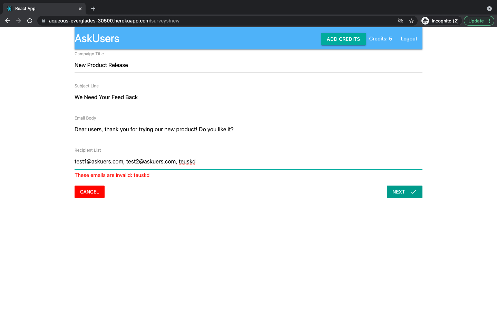

# AskUsers

A web app that helps sending surveys to customers and collecting their feedbacks.

 - Built the app with React, Redux, Node.JS, express, MongoDB Atlas (cloud database) and Heroku.
 - Enabled sign-in services with Google OAuth API and Passport.JS, and payment services with Stripe API.
 - Implemented email-sending and response-collecting processes with SendGrid API and Webhook.

Please visit https://aqueous-everglades-30500.herokuapp.com/ to access the app.

## Demo
1. This is the landing page before login.

2. You can login with a Google account.

3. After login, you'll be directed to the survey creation page.

4. Before sending a survey, don't forget to add credits first! (Each user has 3 free credits!)

5. Press the red  button on the lower-right corner to create a survey!

6. Input the surveys and the recipients. You can send the survey to multiple recipients.

7. The portal will remind you if your recipient emails are not valid.

8. Confirmation page. The survey will be sent right away, and one credit will be deducted from your account.

9. Your recipients will receive an email.

10. You can track your surveys and your recipients' feedback on the dashboard page!

